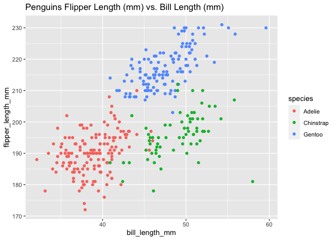

p8105\_hw1\_WZ2591
================
Wenyu Zhang
9/25/2021

``` r
library(tidyverse)
```

    ## ── Attaching packages ─────────────────────────────────────── tidyverse 1.3.1 ──

    ## ✓ ggplot2 3.3.5     ✓ purrr   0.3.4
    ## ✓ tibble  3.1.4     ✓ dplyr   1.0.7
    ## ✓ tidyr   1.1.3     ✓ stringr 1.4.0
    ## ✓ readr   2.0.1     ✓ forcats 0.5.1

    ## ── Conflicts ────────────────────────────────────────── tidyverse_conflicts() ──
    ## x dplyr::filter() masks stats::filter()
    ## x dplyr::lag()    masks stats::lag()

# Problem 1

## Create a data frame comprised of different types of variables:

First, create a data frame comprised of:

1.  a random sample of size 10 from a standard Normal distribution;
2.  a logical vector indicating whether elements of the sample are
    greater than 0;
3.  character vector of length 10;
4.  a factor vector of length 10, with 3 different factor “levels”.

``` r
#create a data_frame
  set.seed(1234)
  data_frame = tibble (
    vec_numeric = rnorm(10),
    vec_logical = vec_numeric > 0,
    vec_character = c("a", "b", "c", "d", "e", "my", "name", "is", "wenyu", "zhang"),
    vec_factor = factor(c("Medium", "High", "Medium", "Low", "Low", "Medium", "High", "High", "Low", "Medium"))
  )

#check the data_frame
  data_frame
```

    ## # A tibble: 10 × 4
    ##    vec_numeric vec_logical vec_character vec_factor
    ##          <dbl> <lgl>       <chr>         <fct>     
    ##  1      -1.21  FALSE       a             Medium    
    ##  2       0.277 TRUE        b             High      
    ##  3       1.08  TRUE        c             Medium    
    ##  4      -2.35  FALSE       d             Low       
    ##  5       0.429 TRUE        e             Low       
    ##  6       0.506 TRUE        my            Medium    
    ##  7      -0.575 FALSE       name          High      
    ##  8      -0.547 FALSE       is            High      
    ##  9      -0.564 FALSE       wenyu         Low       
    ## 10      -0.890 FALSE       zhang         Medium

## Calculate the mean of each variable in dataframe

Now calculate the mean of each variable in the data frame.

It can work to get the mean of the numeric vectors and the logical
vectors. The mean function converts the logical vectors from “TRUE” and
“FALSE” to 1 and 0, respectively, and calculates their arithmetic mean.
Code and results are shown below.

``` r
#the mean of the numeric vectors and the logical vector
  mean(pull(data_frame, vec_numeric))
```

    ## [1] -0.3831574

``` r
  mean(pull(data_frame, vec_logical))
```

    ## [1] 0.4

The mean value of vec\_numeric is -0.3831574, and the mean value of
vec\_logical is 0.4

``` r
#the mean of the character vectors and the factor vector
  mean(pull(data_frame, vec_character))
```

    ## Warning in mean.default(pull(data_frame, vec_character)): argument is not
    ## numeric or logical: returning NA

    ## [1] NA

``` r
  mean(pull(data_frame, vec_factor))
```

    ## Warning in mean.default(pull(data_frame, vec_factor)): argument is not numeric
    ## or logical: returning NA

    ## [1] NA

The mean value of vec\_character and vec\_factor are returned to NA, and
a warning shows up. It is because mean function doesn’t support these
two types of variables.

## Apply the as.numeric function to the logical, character, and factor variables

``` r
  as.numeric(pull(data_frame, vec_logical))
  as.numeric(pull(data_frame, vec_character))
  as.numeric(pull(data_frame, vec_factor))
```

After coercing the logical, character, and factor variables into type
“numeric”.

Logical vectors “FALSE” and “TRUE” are turned into 0 and 1,
respectively. Character variables are all returned to NA, and a warning
shows up. Factor objects are turned to numbers showing their different
levels. This help explain what happens when calculating the mean.

# Problem 2

## Describe the data in this dataset, including names / values of important variables

The name of data is “penguins” with 8 variables: species, island,
bill\_length\_mm, bill\_depth\_mm, flipper\_length\_mm, body\_mass\_g,
sex and year.

``` r
  data("penguins", package = "palmerpenguins")
  names(penguins)
```

    ## [1] "species"           "island"            "bill_length_mm"   
    ## [4] "bill_depth_mm"     "flipper_length_mm" "body_mass_g"      
    ## [7] "sex"               "year"

``` r
  skimr::skim(penguins)
```

|                                                  |          |
|:-------------------------------------------------|:---------|
| Name                                             | penguins |
| Number of rows                                   | 344      |
| Number of columns                                | 8        |
| \_\_\_\_\_\_\_\_\_\_\_\_\_\_\_\_\_\_\_\_\_\_\_   |          |
| Column type frequency:                           |          |
| factor                                           | 3        |
| numeric                                          | 5        |
| \_\_\_\_\_\_\_\_\_\_\_\_\_\_\_\_\_\_\_\_\_\_\_\_ |          |
| Group variables                                  | None     |

Data summary

**Variable type: factor**

| skim\_variable | n\_missing | complete\_rate | ordered | n\_unique | top\_counts                 |
|:---------------|-----------:|---------------:|:--------|----------:|:----------------------------|
| species        |          0 |           1.00 | FALSE   |         3 | Ade: 152, Gen: 124, Chi: 68 |
| island         |          0 |           1.00 | FALSE   |         3 | Bis: 168, Dre: 124, Tor: 52 |
| sex            |         11 |           0.97 | FALSE   |         2 | mal: 168, fem: 165          |

**Variable type: numeric**

| skim\_variable      | n\_missing | complete\_rate |    mean |     sd |     p0 |     p25 |     p50 |    p75 |   p100 | hist  |
|:--------------------|-----------:|---------------:|--------:|-------:|-------:|--------:|--------:|-------:|-------:|:------|
| bill\_length\_mm    |          2 |           0.99 |   43.92 |   5.46 |   32.1 |   39.23 |   44.45 |   48.5 |   59.6 | ▃▇▇▆▁ |
| bill\_depth\_mm     |          2 |           0.99 |   17.15 |   1.97 |   13.1 |   15.60 |   17.30 |   18.7 |   21.5 | ▅▅▇▇▂ |
| flipper\_length\_mm |          2 |           0.99 |  200.92 |  14.06 |  172.0 |  190.00 |  197.00 |  213.0 |  231.0 | ▂▇▃▅▂ |
| body\_mass\_g       |          2 |           0.99 | 4201.75 | 801.95 | 2700.0 | 3550.00 | 4050.00 | 4750.0 | 6300.0 | ▃▇▆▃▂ |
| year                |          0 |           1.00 | 2008.03 |   0.82 | 2007.0 | 2007.00 | 2008.00 | 2009.0 | 2009.0 | ▇▁▇▁▇ |

The name of data is “penguins” with 8 variables: species, island,
bill\_length\_mm, bill\_depth\_mm, flipper\_length\_mm, body\_mass\_g,
sex and year.

## Describe the size of data set.

There are 344 rows and 8 columns within the dataset.

``` r
  nrow(penguins)
```

    ## [1] 344

``` r
  ncol(penguins)
```

    ## [1] 8

## Calculate the mean flipper length

The mean of flipper length is 200.9152

``` r
  mean(penguins$flipper_length_mm, na.rm = TRUE)
```

    ## [1] 200.9152

## Graphing

Make a scatter plot of flipper\_length\_mm (y) vs bill\_length\_mm (x).
Export the first scatterplot to your project directory using ggsave. The
plot will be saved to a .pdf file called hwl\_plot.png.

``` r
  ggplot(penguins, aes(x = bill_length_mm, y = flipper_length_mm, color=species, na.rm = TRUE)) + geom_point(na.rm = TRUE) + ggtitle("Penguins Flipper Length (mm) vs. Bill Length (mm)")
```

<!-- -->

``` r
  ggsave(filename = "hw1_plot.png", height = 4, width = 6)
```
